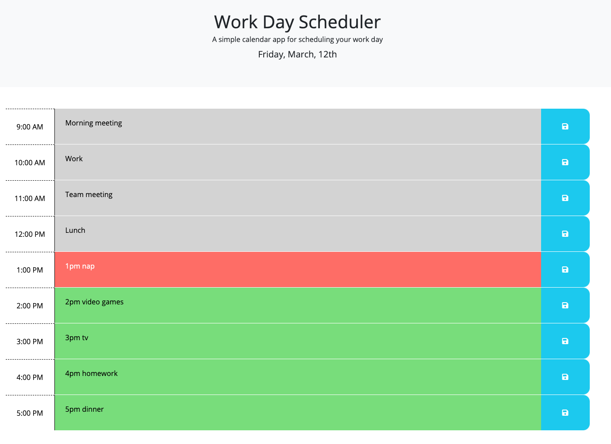

# homework-05-work-day-scheduler

## Description

This application is a work day calendar. It shows the current day and hourly time blocks from 9am-5pm for the user to enter calendar entries. 

## Functionality

* Using Momentjs, the current day is dislpayed in the header.
* I used jquery and momentjs to perform a conditional function to colorize each hour block based on if the time has passed, if it's the current hour, or if it's in the future.
* I used jquery for a single click event listener tied to all of the save buttons.
* The calendar entries are saved to local storage and displayed when the page loads.
* I used Bootstrap Grid for the page layout, along with Bootstrap classes for Flexbox, colors, and margins.
* The application is mobile responsive.

## Live Application
You can view the live application [here](https://mrpancakes.github.io/homework-05-work-day-scheduler/), along with the GitHub repo [here](https://github.com/mrpancakes/homework-05-work-day-scheduler).

